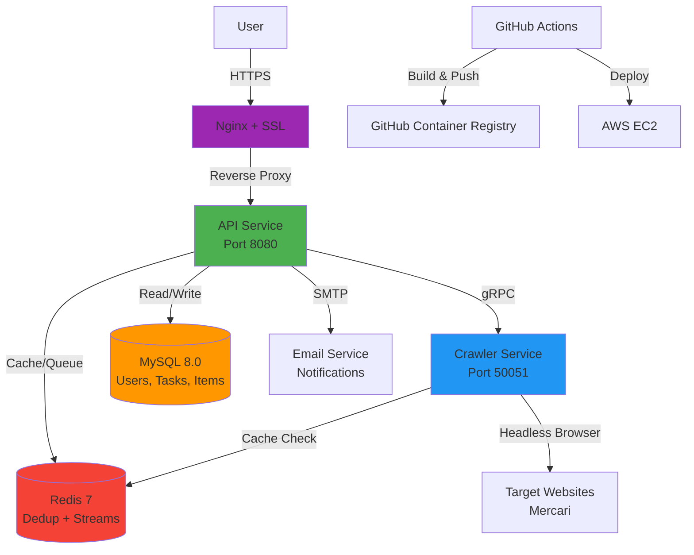
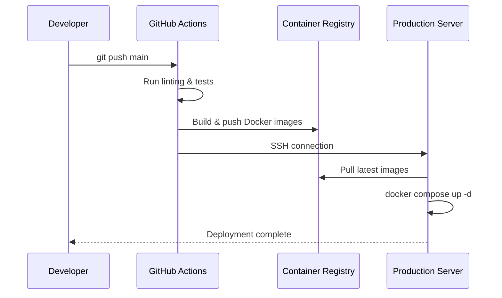

# GoodsHunter

**Languages / 言語 / 语言**: [中文](README.md) | [English](README.en.md) | [日本語](README.ja.md)

[](https://go.dev/)
[](https://www.docker.com/)
[](LICENSE)
[](https://goods-hunter.com)

> **Scalable microservice-based web crawler for real-time e-commerce monitoring**  

**Live Demo**: [https://goods-hunter.com](https://goods-hunter.com)

## Application Preview


---

## Project Overview

GoodsHunter is a **high-performance web crawler** system designed to monitor e-commerce platforms (such as Mercari) for new listings matching user-defined search criteria. It demonstrates enterprise-level system design through:

- **Microservices Architecture**: Separate API and Crawler services communicating via gRPC
- **Horizontally Scalable**: Architecture supports expansion to distributed deployment (multi-instance + load balancing)
- **Task Scheduling System**: Automated polling with configurable intervals and deduplication
- **Real-time Notifications**: Email alerts for new items and price changes
- **Stateful Cache + Distributed Queue**: Redis dedup state + Redis Streams task queue
- **Production Deployment**: Fully automated CI/CD pipeline with Docker, HTTPS, and cloud hosting

Built from scratch to demonstrate **production-ready full-stack backend capabilities**. The architecture is designed with future distributed scaling in mind.

---

## System Architecture



### **Core Components**

| Service | Technology | Responsibility |
|---------|-----------|----------------|
| **API Server** | Go + Gin Framework | User authentication (JWT), RESTful API, task scheduling |
| **Crawler Service** | Go + Rod | Headless browser automation, HTML parsing, gRPC server |
| **Database** | MySQL 8.0 | Persistent storage for users, tasks, and crawled items |
| **Cache Layer** | Redis 7 | Dedup tracking, price change detection, task queue |
| **Gateway** | Nginx + Let's Encrypt | HTTPS termination, static file serving, reverse proxy |
| **CI/CD** | GitHub Actions | Automated testing, Docker image builds, EC2 deployment |

---

## Core Features

### Smart Task Scheduling
- User-defined search queries converted into **periodic crawling tasks**
- Configurable intervals (5min to daily) with automatic execution
- **Worker pool** pattern for controlled concurrency

### Intelligent Deduplication
- **Redis-based fingerprinting**: Tracks seen items to avoid duplicate notifications
- **Redis Streams queue**: Distributed scheduling with multi-instance consumers
- **Price change detection**: Alerts users when monitored items drop in price
- **Incremental crawling**: Only fetches new data since last run

### Production-Ready Authentication
- **JWT-based session management** with secure token storage
- **Email verification** workflow for new registrations
- **Invite-code system** to control user onboarding

### Automated Deployment
- **Zero-downtime updates**: CI/CD pipeline automatically deploys on `git push`
- **Health checks**: Docker-native healthchecks ensure reliability
- **HTTPS by default**: Automated SSL certificate management via Certbot

---

## Technology Stack

### **Backend**
- **Language**: Go 1.25 (chosen for concurrency primitives and performance)
- **Web Framework**: Gin (high-performance HTTP framework with rich middleware ecosystem)
- **RPC**: gRPC + Protocol Buffers (for inter-service communication)
- **ORM**: GORM (database abstraction with migration support)
- **Browser Automation**: Rod (fast and reliable DevTools Protocol library)

### **Infrastructure**
- **Containerization**: Docker + Docker Compose
- **Orchestration**: Multi-stage builds for optimized image sizes
- **CI/CD**: GitHub Actions (linting, building, automated deployment)
- **Cloud Provider**: AWS EC2 (Ubuntu 22.04 LTS)
- **SSL Management**: Let's Encrypt + Certbot (automated renewal)

### **Data Layer**
- **Primary Database**: MySQL 8.0 (relational data with ACID guarantees)
- **Cache Store**: Redis 7 (dedup, state, and queues)
- **Message Queue**: Redis Streams + in-memory queue (switchable)

### **DevOps**
- **Version Control**: Git + GitHub
- **Container Registry**: GitHub Container Registry (GHCR)
- **Monitoring**: Docker health checks + structured logging (slog)
- **Configuration**: Environment-based config (12-factor app methodology)

---

## Quick Start

### **Prerequisites**
- Docker 20.10+ and Docker Compose v2+
- (Optional) SMTP credentials for email notifications

### **1. Clone the Repository**
```bash
git clone https://github.com/KahanaT800/GoodsHunter.git
cd GoodsHunter
```

### **2. Configure Environment**
```bash
cp .env.example .env
# Edit .env with your settings:
# - MYSQL_ROOT_PASSWORD
# - REDIS_PASSWORD
# - JWT_SECRET
# - SMTP credentials (optional)
```

### **3. Start Services**
```bash
docker compose up -d
```

### **4. Access the Application**
- **Web UI**: http://localhost
- **API Healthcheck**: http://localhost/api/healthz

### **5. Register and Login**
```bash
# Guest login (no email required)
curl -X POST http://localhost/api/login/guest

# Or create a full account
curl -X POST http://localhost/api/register \
  -H "Content-Type: application/json" \
  -d '{"email":"user@example.com","password":"secure123","invite_code":"YOUR_CODE"}'
```

---

## Project Structure

```
GoodsHunter/
├── cmd/
│   ├── api/                 # API service entrypoint
│   └── crawler/             # Crawler service entrypoint
├── internal/
│   ├── api/                 # HTTP handlers, middleware, authentication
│   │   ├── auth/            # JWT token management
│   │   ├── middleware/      # CORS, logging, auth middleware
│   │   └── scheduler/       # Background task scheduler
│   ├── crawler/             # Browser automation, HTML parsing
│   ├── config/              # Configuration loader (supports env vars)
│   ├── model/               # Database models (GORM)
│   └── pkg/                 # Shared utilities
│       ├── logger/          # Structured logging wrapper
│       ├── notify/          # Email notification service
│       └── queue/           # Thread-safe task queue
├── build/
│   ├── api/Dockerfile       # Multi-stage build for API
│   └── crawler/Dockerfile   # Multi-stage build for Crawler
├── proto/                   # gRPC service definitions
├── web/                     # Frontend static files (HTML/CSS/JS)
├── .github/workflows/       # CI/CD pipelines
│   ├── ci.yml              # Linting and testing
│   └── deploy.yml          # Automated deployment
├── docker-compose.yml       # Local development orchestration
└── scripts/init-letsencrypt.sh     # HTTPS certificate automation script
```

---

## API Documentation

### **Authentication**
```http
POST /api/register           # User registration
POST /api/login              # User login
POST /api/login/guest        # Guest login
POST /api/verify-email?token=xxx  # Email verification
```

### **Task Management**
```http
GET    /api/tasks           # List user's monitoring tasks
POST   /api/tasks           # Create new task
DELETE /api/tasks/:id       # Remove task
```

### **Timeline**
```http
GET /api/timeline?limit=50  # Fetch latest crawled items
```

### **Health Check**
```http
GET /healthz                # Service status (used by Docker)
```

---

## Production Deployment

### **Architecture Highlights**
- **AWS EC2**: t3.small instance (2 vCPU, 2GB RAM)
- **HTTPS**: Let's Encrypt certificate with automatic renewal
- **Zero-downtime CI/CD**: GitHub Actions builds Docker images → pushes to GHCR → SSH into EC2 → pulls and restarts containers
- **Security**: Non-root containers, secret management via environment variables

### **Deployment Flow**


### **Performance Metrics**
- **Cold start**: ~30 seconds (includes MySQL initialization)
- **API response time**: <50ms (cached queries)
- **Crawler throughput**: ~100 items/minute (rate-limited to avoid blocking)
- **Uptime**: 99.5%+ (monitored via health checks)

---

## Development

### **Running Tests**
```bash
go test ./internal/pkg/queue/...
```

### **Linting**
```bash
golangci-lint run
```

### **Viewing Logs**
```bash
docker logs goodshunter-api-1 -f
docker logs goodshunter-crawler-1 -f
```

### **Stopping Services**
```bash
docker compose down
```

---

## What This Project Demonstrates

### **Backend Engineering**
✅ **Microservices Design**: Service separation with gRPC for inter-process communication  
✅ **Concurrency Control**: Worker pools, mutex locks, and graceful shutdown  
✅ **Data Modeling**: Normalized database schema with proper indexing  
✅ **Caching Strategy**: Redis-based deduplication and state management  

### **DevOps & Infrastructure**
✅ **Containerization**: Multi-stage Docker builds optimized for size  
✅ **CI/CD Automation**: GitHub Actions for testing, building, and deployment  
✅ **SSL/TLS**: Automated HTTPS certificate management  
✅ **Configuration Management**: 12-factor app principles with environment variables  

### **Software Engineering**
✅ **Clean Architecture**: Separation of concerns (handlers, services, models)  
✅ **Error Handling**: Structured logging with context propagation  
✅ **Code Quality**: Automated linting, consistent formatting  
✅ **Documentation**: Comprehensive README and inline code comments  

---

## Technical Decisions & Trade-offs

| Decision | Rationale |
|----------|-----------|
| **Go** | Better concurrency primitives, lower memory footprint, native gRPC support |
| **gRPC** | Type-safe contracts, efficient binary serialization for service-to-service calls |
| **MySQL** | Familiarity, sufficient for current scale, better AWS RDS support |
| **Redis** | Rich data structures (sets for deduplication), persistence options |
| **Gin** | Mature ecosystem, excellent performance, rich middleware support |
| **Rod** | Simpler API, automatic wait mechanisms, better error handling |

---

## Security Considerations

- **JWT Secrets**: Rotated via environment variables (not hardcoded)
- **Password Hashing**: bcrypt with cost factor 10
- **SQL Injection Prevention**: Parameterized queries via GORM
- **HTTPS Enforcement**: All HTTP traffic redirected to HTTPS
- **Rate Limiting**: (Planned) To prevent abuse of crawler endpoints

---

## License

This project is licensed under the **MIT License** - see the [LICENSE](LICENSE) file for details.

---

## Author

**KahanaT800**  
Contact: lyc.muna@gmail.com  
GitHub: [@KahanaT800](https://github.com/KahanaT800)

---

**If this project demonstrates valuable skills, please consider starring the repository!**
