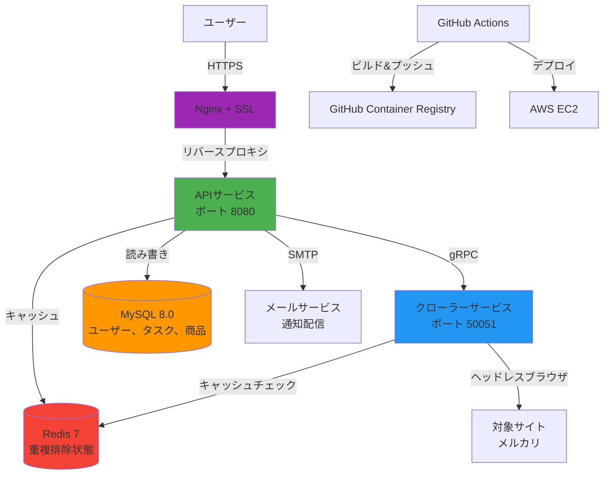

# GoodsHunter

**言語 / Languages / 语言**: [中文](README.md) | [English](README.en.md) | [日本語](README.ja.md)

[](https://go.dev/)
[](https://www.docker.com/)
[](LICENSE)
[](https://goods-hunter.com)

> **スケーラブルなマイクロサービス型クローラーシステム、ECサイトの商品をリアルタイムで監視**  

**デモサイト**: [https://goods-hunter.com](https://goods-hunter.com)

## アプリケーションプレビュー


---

## プロジェクト概要

GoodsHunterは、ユーザー定義の検索条件に一致する新規出品を監視するために設計された**高性能Webクローラー**システムです（メルカリなど）。以下の方法でエンタープライズレベルのシステム設計を実証します：

- **マイクロサービスアーキテクチャ**: APIとクローラーサービスを独立してデプロイし、gRPCで通信
- **水平スケーラブル**: 分散デプロイへの拡張をサポートする設計（マルチインスタンス + ロードバランシング）
- **タスクスケジューリングシステム**: 設定可能な間隔と重複排除による自動ポーリング
- **リアルタイム通知**: 新商品や価格変動のメール通知
- **ステートフルキャッシング**: Redisベースの増分クロール、冗長リクエストを最小限に
- **本番環境デプロイ**: Docker、HTTPS、クラウドホスティングを使用した完全自動化CI/CDパイプライン

本番環境に対応した**フルスタックバックエンド能力**を実証するために、ゼロから構築されました。将来の分散拡張を考慮したアーキテクチャ設計です。

---

## システムアーキテクチャ



### **コアコンポーネント**

| サービス | 技術スタック | 責任範囲 |
|---------|-----------|----------------|
| **APIサーバー** | Go + Ginフレームワーク | ユーザー認証（JWT）、RESTful API、タスクスケジューリング |
| **クローラーサービス** | Go + Rod | ヘッドレスブラウザ自動化、HTML解析、gRPCサーバー |
| **データベース** | MySQL 8.0 | ユーザー、タスク、クロール済み商品の永続化ストレージ |
| **キャッシュレイヤー** | Redis 7 | 重複排除トラッキング、価格変動検出 |
| **ゲートウェイ** | Nginx + Let's Encrypt | HTTPS終端、静的ファイル配信、リバースプロキシ |
| **CI/CD** | GitHub Actions | 自動テスト、Dockerイメージビルド、EC2デプロイ |

---

## コア機能

### スマートタスクスケジューリング
- ユーザー定義の検索クエリを**定期的なクロールタスク**に変換
- 設定可能な実行間隔（5分～毎日）、自動実行
- **ワーカープール**パターンによる並行制御

### インテリジェント重複排除
- **Redisベースのフィンガープリンティング**: 既存商品を追跡し、重複通知を防止
- **価格変動検出**: 監視商品の値下がり時にユーザーに通知
- **増分クロール**: 前回実行以降の新データのみ取得

### 本番環境対応の認証システム
- **JWTベースのセッション管理**、安全なトークンストレージ
- 新規登録用の**メール認証**ワークフロー
- ユーザー登録を制御する**招待コードシステム**

### 自動化されたデプロイ
- **ゼロダウンタイム更新**: `git push`後にCI/CDパイプラインが自動デプロイ
- **ヘルスチェック**: Dockerネイティブのヘルスチェックで信頼性を確保
- **デフォルトでHTTPS**: Certbotによる自動SSL証明書管理

---

## 技術スタック

### **バックエンド**
- **言語**: Go 1.25（並行処理プリミティブとパフォーマンスで選択）
- **Webフレームワーク**: Gin（高性能HTTPフレームワーク、豊富なミドルウェアエコシステム）
- **RPC**: gRPC + Protocol Buffers（サービス間通信用）
- **ORM**: GORM（マイグレーションサポート付きデータベース抽象化）
- **ブラウザ自動化**: Rod（高速で信頼性の高いDevTools Protocolライブラリ）

### **インフラストラクチャ**
- **コンテナ化**: Docker + Docker Compose
- **オーケストレーション**: イメージサイズ最適化のためのマルチステージビルド
- **CI/CD**: GitHub Actions（リンティング、ビルド、自動デプロイ）
- **クラウドプロバイダー**: AWS EC2（Ubuntu 22.04 LTS）
- **SSL管理**: Let's Encrypt + Certbot（自動更新）

### **データレイヤー**
- **プライマリデータベース**: MySQL 8.0（ACID保証付きリレーショナルデータ）
- **キャッシュストア**: Redis 7（重複排除ロジック用の高速キーバリューストア）
- **メッセージキュー**: カスタムインメモリキュー（クローラータスク配信用）

### **DevOps**
- **バージョン管理**: Git + GitHub
- **コンテナレジストリ**: GitHub Container Registry（GHCR）
- **モニタリング**: Dockerヘルスチェック + 構造化ログ（slog）
- **設定管理**: 環境変数ベースの設定（12-factorアプリ手法）

---

## クイックスタート

### **前提条件**
- Docker 20.10+ および Docker Compose v2+
- （オプション）メール通知用のSMTP認証情報

### **1. リポジトリのクローン**
```bash
git clone https://github.com/KahanaT800/GoodsHunter.git
cd GoodsHunter
```

### **2. 環境変数の設定**
```bash
cp .env.example .env
# .envファイルを編集して以下を設定：
# - MYSQL_ROOT_PASSWORD
# - REDIS_PASSWORD
# - JWT_SECRET
# - SMTP認証情報（オプション）
```

### **3. サービスの起動**
```bash
docker compose up -d
```

### **4. アプリケーションへのアクセス**
- **Web UI**: http://localhost
- **APIヘルスチェック**: http://localhost/api/healthz

### **5. 登録とログイン**
```bash
# ゲストログイン（メール不要）
curl -X POST http://localhost/api/login/guest

# または完全なアカウント作成
curl -X POST http://localhost/api/register \
  -H "Content-Type: application/json" \
  -d '{"email":"user@example.com","password":"secure123","invite_code":"YOUR_CODE"}'
```

---

## 技術的意思決定とトレードオフ

| 意思決定 | 理由 |
|----------|-----------|
| **Go** | 優れた並行処理プリミティブ、低メモリフットプリント、ネイティブgRPCサポート |
| **gRPC** | 型安全な契約、サービス間呼び出しのための効率的なバイナリシリアライゼーション |
| **MySQL** | 習熟度、現在の規模に十分、より良いAWS RDSサポート |
| **Redis** | 豊富なデータ構造（重複排除用のセット）、永続化オプション |
| **Gin** | 成熟したエコシステム、優れたパフォーマンス、豊富なミドルウェアサポート |
| **Rod** | よりシンプルなAPI、自動待機メカニズム、より良いエラーハンドリング |

---

## セキュリティ考慮事項

- **JWTシークレット**: 環境変数経由でローテーション（ハードコードなし）
- **パスワードハッシュ**: bcrypt、コストファクター10
- **SQLインジェクション防止**: GORMによるパラメータ化クエリ
- **HTTPS強制**: すべてのHTTPトラフィックをHTTPSにリダイレクト
- **レート制限**: （計画中）クローラーエンドポイントの悪用防止

---

## ライセンス

このプロジェクトは**MITライセンス**の下でライセンスされています - 詳細は[LICENSE](LICENSE)ファイルをご覧ください。

---

## 作者

**KahanaT800**  
連絡先: lyc.muna@gmail.com  
GitHub: [@KahanaT800](https://github.com/KahanaT800)

---

**このプロジェクトが価値あるスキルを示していると思われる場合は、リポジトリにスターをつけていただけると幸いです！**
