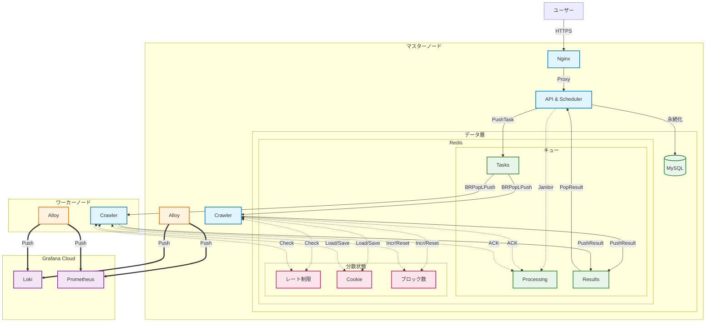

# GoodsHunter V2.1

**言語 / Languages**: [English](README.md) | [日本語](README.ja.md)

> **高性能・分散型 ACGNグッズ監視＆特売ハンティングシステム（高度なアンチ検出機能付き）**

**GoodsHunter** は、ACGNの中古市場（メルカリなど）に特化した監視システムです。これらの市場では、安価な人気商品は出品後数分で売り切れてしまいます。GoodsHunter はタスク駆動型監視とリアルタイムアラートにより、出品された瞬間を逃さずキャッチします。


[](https://github.com/KahanaT800/GoodsHunter/actions/workflows/ci.yml)

---

## 🌐 [GoodsHunter へアクセス](https://goods-hunter.com/)

## スクリーンショット

### Web 管理インターフェース


### システム監視 ([ライブデモ](https://lycmuna.grafana.net/goto/afa3n3hqjpu68b?orgId=stacks-1490156))
[](https://lycmuna.grafana.net/goto/afa3n3hqjpu68b?orgId=stacks-1490156)

### ビジネスメトリクス ([ライブデモ](https://lycmuna.grafana.net/goto/dfa3n1ojc4p34b?orgId=stacks-1490156))
[](https://lycmuna.grafana.net/goto/dfa3n1ojc4p34b?orgId=stacks-1490156)

---

## 主な機能

| 機能 | 説明 |
|------|------|
| **分散アーキテクチャ** | マスター・ワーカー構成によるハイブリッドデプロイ（クラウドAPI＋自宅ワーカー） |
| **高信頼性キュー** | Redis RPOPLPUSH パターンと Janitor リカバリーでタスク損失ゼロを保証 |
| **分散レート制限** | Redis Lua スクリプトによるトークンバケット、全ノード間で協調 |
| **アンチ検出 (V2.1)** | ステルススクリプト、人間行動シミュレーション、Cookie永続化 |
| **適応型スロットリング** | 連続ブロック検出時の自動クールダウン（Redis同期カウンター） |
| **自己修復ワーカー** | 定数タスク後の自動再起動戦略（Docker restart: always） |
| **フルスタック監視** | Grafana Alloy によるメトリクス・ログ統合 |

📖 **[機能の詳細 →](docs/architecture/design.md)**

---

## クイックスタート

### 前提条件
- Docker & Docker Compose
- （オプション）Grafana Cloud アカウント

### マスターノード
```bash
git clone https://github.com/KahanaT800/GoodsHunter.git
cd GoodsHunter
cp configs/config.yaml.example configs/config.yaml
docker-compose up -d
```

### ワーカーノード
```bash
# 環境変数を設定
export REDIS_ADDR=<master-ip>:6379
export REDIS_PASSWORD=<your-password>
export WORKER_ID=worker-01

docker-compose -f docker-compose.worker.yml up -d
```

📖 **[デプロイガイドの詳細 →](docs/ops/deployment_modes.md)**

---

## 設定

### 主要な環境変数

| 変数 | 説明 | デフォルト |
|------|------|-----------|
| `REDIS_ADDR` | マスター Redis アドレス | `redis:6379` |
| `REDIS_PASSWORD` | Redis パスワード | (空) |
| `WORKER_ID` | ワーカー識別子 | `worker-01` |
| `APP_RATE_LIMIT` | 秒間リクエスト数 | `3` |
| `BROWSER_MAX_CONCURRENCY` | 同時ブラウザページ数 | `3` |
| `MAX_TASKS` | 自動再起動までのタスク数 | `500` |

📖 **[設定リファレンスの詳細 →](docs/ops/configuration.md)**

---

## アーキテクチャ

Redis をメッセージブローカー＆分散状態ストアとして使用するマスター・ワーカー構成。



**ポイント:**
- **高信頼性キュー**: `BRPopLPush` と Janitor リカバリーでタスク損失ゼロ
- **分散状態**: レート制限、Cookie キャッシュ、ブロックカウンターを全ノードで Redis 共有

📖 **[アーキテクチャの詳細 →](docs/architecture/design.md)**

---

## モニタリング

ライブダッシュボード:
- **[クラスター概要](https://lycmuna.grafana.net/goto/bfa3n69fhbv9cb?orgId=stacks-1490156)**
- **[マスターノード](https://lycmuna.grafana.net/goto/afa3n3hqjpu68b?orgId=stacks-1490156)**
- **[ビジネスメトリクス](https://lycmuna.grafana.net/goto/dfa3n1ojc4p34b?orgId=stacks-1490156)**

Grafana JSON テンプレート: `docs/ops/grafana/`

---

## ドキュメント

| トピック | リンク |
|----------|--------|
| アーキテクチャ設計 | [docs/architecture/design.md](docs/architecture/design.md) |
| 設定ガイド | [docs/ops/configuration.md](docs/ops/configuration.md) |
| デプロイモード | [docs/ops/deployment_modes.md](docs/ops/deployment_modes.md) |
| ローカルテスト | [docs/dev/local_test_checklist.md](docs/dev/local_test_checklist.md) |

---

## 📄 ライセンス

MIT License. 詳細は [LICENSE](LICENSE) を参照してください。
