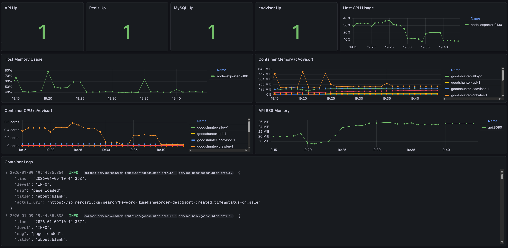
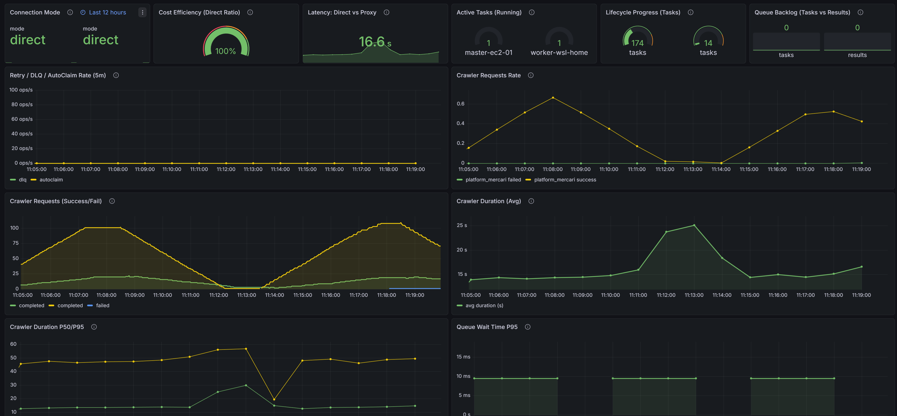
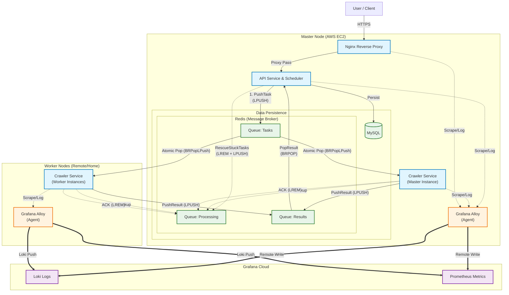

# GoodsHunter V2.0

**言語 / Languages / 语言**: [English](README.md) | [日本語](README.ja.md)

> **高性能・分散型 ACGNグッズ監視・特売ハンティングシステム**

**GoodsHunter** は、ACGNの中古市場（メルカリなど）に特化した監視システムです。これらの市場では、安価な人気商品は出品後数分で売り切れてしまいます。従来のクローラーでは SPA（シングルページアプリケーション）アーキテクチャへの対応が難しく、手動での検索も非効率的でした。

GoodsHunter は以下の機能でこれらの課題を解決します：
- **タスク駆動型監視**: ユーザーの検索意図を永続的な監視タスクとして抽象化。
- **リアルタイム & 増分取得**: インテリジェントな重複排除を用いた定期的フェッチにより、出品された瞬間を逃さずキャッチ。
- **即時通知**: タイムライン UI やマルチチャンネル通知機能で、重要な情報を即座に届けます。

V2.0 では、モノリシックなアプリケーションから完全な **分散型マスター・ワーカー構成** へとパラダイムシフトしました。安定したクラウドサーバー（マスター）でタスクを管理しつつ、高性能なローカルマシン（ワーカー）で重いクローリング処理を実行する「ハイブリッド運用」が可能です。


[](https://github.com/KahanaT800/GoodsHunter/actions/workflows/ci.yml)
---
## 🌐 [GoodsHunter へアクセス](https://goods-hunter.com/)

## スクリーンショット

### Web 管理インターフェース (ゲストビュー)

*リアルタイムでのタスク管理と追跡。*

### マスターノード システム監視
[](https://lycmuna.grafana.net/goto/afa3n3hqjpu68b?orgId=stacks-1490156)
*[ライブデモ: マスターノード システムメトリクス](https://lycmuna.grafana.net/goto/afa3n3hqjpu68b?orgId=stacks-1490156)*

### クローラー ビジネスメトリクス
[](https://lycmuna.grafana.net/goto/dfa3n1ojc4p34b?orgId=stacks-1490156)
*[ライブデモ: クローラー ビジネスメトリクス](https://lycmuna.grafana.net/goto/dfa3n1ojc4p34b?orgId=stacks-1490156)*

---

## アーキテクチャ

本システムは、典型的なマスター・ワーカー構成を採用しています。マスターノードは状態管理、スケジューリング、データの永続化を担当し、ステートレスなワーカーノードが実際のデータ収集を行います。



### 🔍 図解：高信頼性キューモデル

このアーキテクチャは、タスクの消失を防ぐために **信頼性の高いキュー（Reliable Queue**） システムを実装しています：

1.  **疎結合**: API は Redis とのみ通信します。ワーカーは自律的なコンシューマーとして動作します。
2.  **原子的転送**: ワーカーがタスクを取得する際、`BRPopLPush` を使用して「保留リスト `Pending List`」から「処理中リスト `Processing List`」へ原子的に移動させます。
3.  **処理状態の保持:**: ワーカーが処理を行っている間、タスクはバックアップとして「処理中リスト」に保持されます。
4.  **ACK メカニズム**: 処理が完了すると、ワーカーは ACK（`LREM` の実行）を送信し、タスクを「処理中リスト」から削除します。
5.  **スケジューラーとリカバリ**: マスターノードの API には Reaper（死活監視） ルーチンが組み込まれています。タスクが長時間「処理中リスト」に残っている場合（例：ワーカーの電源断など）、自動的に回収され、再試行のために「保留リスト」に戻されます。

---

## 主な機能

### 1. 分散アーキテクチャ
ワーカーノードを追加するだけで無限にスケール可能です。**ハイブリッドデプロイ** をサポートしており、データベースや API は安定した低コストのクラウドサーバーに配置し、帯域幅や CPU リソースを大量に消費するブラウザ自動化処理は、手元の高性能マシンにオフロードすることができます。

### 2. 高信頼性キュー
データの安全性は最優先事項です。`Redis BRPOPLPUSH`（ブロッキング・アトミック移動）パターンを採用し、バックアップ処理キューを備えています。
- ワーカーがタスクを取得すると（ブロッキング待機）、タスクは `goodshunter:queue:tasks` から `goodshunter:queue:tasks:processing` へ移動します。
- 万が一ワーカーがクラッシュしたり電源が落ちたりしても、データは失われません。タスクは処理中キューに残り、Reaper プロセスによって安全に回収されます。

### 3. 分散レート制限
ワーカーのブロックを防ぐため、トークンバケットアルゴリズムを使用した **Redis Lua Script** によるレート制限を実装しています。分散しているすべてのノード全体で、ターゲットサイトへのリクエスト頻度を厳密に制御します。

### 4. フルスタック・オブザーバビリティ
**Grafana Alloy** と統合されています。
- **自動注入**: すべてのメトリクス送信に `WORKER_ID` が付与されるため、パフォーマンスの問題が発生した際に特定のノードを追跡可能です。
- **統合ロギング**: すべての分散ノードからのログが Grafana Loki に転送され、一箇所で検索・分析が可能です。

### 5. 自己修復ワーカー
Headless Chrome は長時間稼働するとメモリリークを起こしやすい傾向があります。これを解決するため、**「定数終了」** 戦略を採用しました。各ワーカーは `MAX_TASKS` に達するとコンテナを正常終了し、Docker の `restart: always` ポリシーにより即座にクリーンなインスタンスが再起動します。これにより、手動メンテナンスなしで 24時間365日の安定稼働を実現します。

### 6. スマートプロキシ戦略 (コスト最適化)
プロキシは高価です。GoodsHunter はインテリジェントな **ハイブリッドネットワーク戦略** を実装しています。ワーカーは通常、コスト削減と低レイテンシのために「直接接続」を使用します。403 ブロックを検知した場合にのみ自動的にプロキシモードに切り替え、一定時間の `PROXY_COOLDOWN` に入ります。

### 7. インテリジェントな重複排除
タスクがスケジュールされる前に、`dedup` パッケージがターゲットパラメータのハッシュを計算します。類似のタスクがすでに保留中であったり、最近処理されたばかりの場合は、重複タスクは即座に破棄されます。これにより CPU サイクルと帯域幅を節約し、ワーカーが常に新鮮なデータに集中できるようにします。

---

## デプロイガイド

### Prerequisites
- Docker & Docker Compose
- Grafana Cloud アカウント (Alloy メトリクス/ログ用)

### Part 1: マスターノードのセットアップ
データベースと Redis スケジューラーをホストするノードです。

1. **リポジトリのクローン**
   ```bash
   git clone https://github.com/KahanaT800/GoodsHunter.git
   cd GoodsHunter
   ```

2. **環境設定**
   ```bash
   cp configs/config.yaml.example configs/config.yaml
   # Ensure you set your GRAFANA_CLOUD_* credentials in .env or proper config
   ```

3. **ネットワークの保護**:
   - TCP ポート **6379** (Redis) がワーカーノードからアクセス可能であることを確認してください。
   - **セキュリティ警告**: 強力な `REDIS_PASSWORD` を使用し、セキュリティグループ/ファイアウォールでアクセスを制限（自宅の IP のみ許可など）してください。

4. **マスターサービスの開始**:
   ```bash
   docker-compose up -d
   ```

### Part 2: ワーカーノードのセットアップ
クローラーと Alloy のみを実行するノードです。

1. **環境設定**:
   `.env` を編集するか、環境変数を直接設定します。最も重要なのは、マスターノードを指す `REDIS_ADDR` です。

   **ワーカー用 `.env` 例**:
   ```ini
   # Point to your Master Node IP
   REDIS_ADDR=123.45.67.89:6379
   REDIS_PASSWORD=your_strong_password
   
   # Unique Identity for this worker
   WORKER_ID=home-pc-gaming-rig-01
   
   # Grafana Credentials for Observability
   GRAFANA_CLOUD_PROM_REMOTE_WRITE_URL=https://prometheus-blocks-prod-....
   GRAFANA_CLOUD_PROM_USERNAME=123456
   GRAFANA_CLOUD_PROM_API_KEY=glc_....
   ```

2. **ワーカーの開始**:
   ワーカー専用の compose ファイルを使用します。
   ```bash
   docker-compose -f docker-compose.worker.yml up -d
   ```

3. **接続確認**:
  ログを確認し、マスターの Redis に正常に接続できているかチェックします。
   ```bash
   docker-compose -f docker-compose.worker.yml logs -f crawler
   ```

---

## 設定リファレンス

| 環境変数 | 説明 |デフォルト値 |
|----------------------|-------------|---------|
| `REDIS_ADDR` | **ワーカーで必須。** マスター Redis のアドレス | `redis:6379` |
| `REDIS_PASSWORD` | Redis 認証用パスワード| `goodshunter_redis` |
| `WORKER_ID` | ノードの一意な識別子（例: `worker-01`） | `worker-01` |
| `APP_RATE_LIMIT` | 許可される秒間リクエスト数（トークンバケットレート） | `3` |
| `APP_RATE_BURST` | 許可される最大バースト数 | `5` |
| `BROWSER_HEADLESS` | Chrome をヘッドレスモードで実行, 動作を見たい場合は `false` に設定 | `true` |
| `GRAFANA_CLOUD_*` | Grafana Cloud へメトリクスを送信するための認証情報 | (Empty) |

---

## モニタリングダッシュボード

`docs/ops/grafana/` ディレクトリに、すぐに使用できる Grafana JSON モデルを用意しています。また、以下のライブ公開ダッシュボードもご覧いただけます：

- **[クラスター概要 (システムリソース)](https://lycmuna.grafana.net/goto/bfa3n69fhbv9cb?orgId=stacks-1490156)**
- **[マスターノード監視](https://lycmuna.grafana.net/goto/afa3n3hqjpu68b?orgId=stacks-1490156)**
- **[ビジネスメトリクス](https://lycmuna.grafana.net/goto/dfa3n1ojc4p34b?orgId=stacks-1490156)**

---

## 📄 ライセンス

MIT License. See [LICENSE](LICENSE) for details.