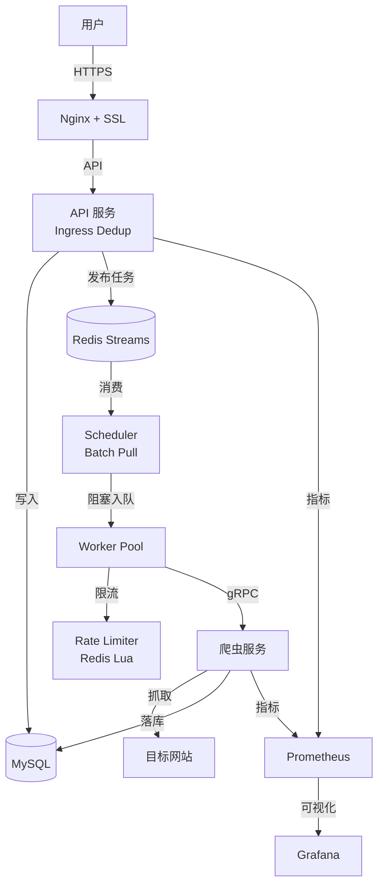
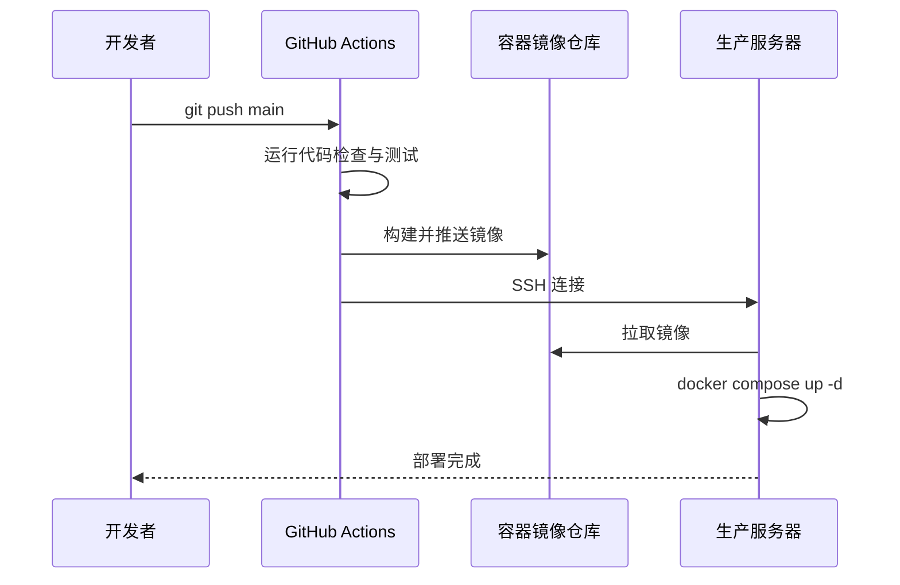

# GoodsHunter

**语言 / Languages / 言語**: [中文](README.md) | [English](README.en.md) | [日本語](README.ja.md)

[](https://go.dev/)
[](https://www.docker.com/)
[](https://github.com/KahanaT800/GoodsHunter/actions/workflows/ci.yml)
[](LICENSE)
[](https://goods-hunter.com)

> **面向生产环境的分布式爬虫系统，聚焦高可靠与可观测**

**在线演示**: [https://goods-hunter.com](https://goods-hunter.com)

## 应用预览

**访客界面**


**系统监控仪表盘**


**爬虫监控仪表盘**


---

## 项目概述

GoodsHunter 是一个**高性能网络爬虫**系统，专为监控电商平台（如 Mercari）中符合用户搜索条件的新商品而设计。当前版本已升级为可分布式部署的高可靠架构：

- **Redis Streams 消费模型**：生产者-消费者模式，支持阻塞消费与背压
- **分布式限流**：Redis Lua 原子令牌桶，多实例共享配额
- **全局去重**：API 入口侧 URL 去重，减少无效任务入库
- **可靠性机制**：ACK、重试、死信队列（DLQ）
- **批量调度**：DB 轮询采用 Cursor 分页 + 批量限制，避免阻塞
- **可观测性**：Prometheus + Grafana 监控关键指标

---

## 系统架构



### 核心组件

| 服务 | 技术栈 | 职责 |
|---------|-----------|----------------|
| **API 服务器** | Go + Gin | 任务创建、入口去重、API 网关 |
| **Scheduler** | Go | Redis Streams 消费、ACK/Retry/DLQ、批量拉取 |
| **爬虫服务** | Go + Rod | 无头浏览器自动化、HTML 解析 |
| **限流器** | Redis Lua | 全局令牌桶，跨实例协调 |
| **数据库** | MySQL 8.0 | 用户、任务和商品持久化 |
| **缓存/队列** | Redis 7 | 去重状态、Streams 队列、限流协作 |
| **网关** | Nginx + Let's Encrypt | HTTPS 终端、静态文件服务、反向代理 |

---

## 核心特性

### 可靠的任务调度
- Redis Streams 生产者-消费者模型
- ACK 仅在 Worker 成功处理后执行
- Pending 回收与 Auto-Claim，防止任务丢失
- 失败重试与 DLQ，拒绝静默失败

### 分布式限流
- Redis Lua 原子令牌桶，跨实例共享配额
- 阻塞等待 + 微小抖动，避免惊群效应
- `APP_RATE_LIMIT` / `APP_RATE_BURST` 可配置

### 全局去重
- API 入口侧 URL Hash 去重
- 重复任务在入库与入队前被拦截
- 降低无效爬取与资源浪费

### 批量调度与背压
- DB 轮询使用 Cursor 分页，默认批量 `APP_QUEUE_BATCH_SIZE=100`
- Worker Pool 阻塞入队，避免“满即丢”

---

## 技术栈

### 后端
- **语言**: Go 1.24
- **Web 框架**: Gin
- **RPC**: gRPC + Protocol Buffers
- **ORM**: GORM
- **浏览器自动化**: Rod

### 基础设施
- **容器化**: Docker + Docker Compose
- **CI/CD**: GitHub Actions
- **云平台**: AWS EC2
- **SSL**: Let's Encrypt + Certbot

### 数据与队列
- **MySQL**: 持久化存储
- **Redis**: 去重、Streams 队列、限流协作

### 可观测性
- **Prometheus**: 指标采集
- **Grafana**: 仪表盘与告警

---

## 监控与可观测性

### 指标端点
- **API**: `http://<host>:8080/metrics`
- **Crawler**: `http://<host>:2112/metrics`（可通过 `CRAWLER_METRICS_ADDR` 覆盖）

### 核心指标（Grafana）
- `goodshunter_ratelimit_wait_duration_seconds`：限流等待耗时
- `goodshunter_task_dlq_total`：进入死信队列的任务数
- `goodshunter_task_duplicate_prevented_total`：入口去重拦截数

### Grafana Cloud（可选）
```bash
docker compose --profile monitoring-cloud up -d alloy
```

---

## Redis Streams 模式（可选）

默认使用数据库轮询调度任务；启用 Redis Streams 后，任务通过队列分发，实现更低延迟与多实例水平扩展。

启用方式（`.env`）：
```bash
APP_ENABLE_REDIS_QUEUE=true
APP_TASK_QUEUE_STREAM=goodshunter:task:queue
APP_TASK_QUEUE_GROUP=scheduler_group
```

---

## 快速开始

### 前置要求
- Docker 20.10+ 与 Docker Compose v2+
- （可选）邮件通知 SMTP 凭据

### 1. 克隆仓库
```bash
git clone https://github.com/KahanaT800/GoodsHunter.git
cd GoodsHunter
```

### 2. 配置环境变量
```bash
cp .env.example .env
# 编辑 .env 文件，设置以下内容：
# - MYSQL_ROOT_PASSWORD  # 数据库密码
# - REDIS_PASSWORD       # Redis 密码
# - JWT_SECRET           # JWT 加密密钥
# - SMTP 凭据（可选）    # 用于邮件通知
```

### 3. 启动服务
```bash
docker compose up -d
```

### 4. 访问应用
- **Web 界面**: http://localhost
- **API 健康检查**: http://localhost/healthz
- **API 指标**: http://localhost/metrics
- **Crawler 指标**: http://localhost:2112/metrics

---

## 配置说明（节选）

以下配置直接影响系统吞吐与稳定性（详见 `.env.example`）：

- `APP_SCHEDULE_INTERVAL`：轮询调度间隔
- `APP_WORKER_POOL_SIZE`：Worker Pool 并发数
- `APP_QUEUE_CAPACITY`：内存队列容量
- `APP_QUEUE_BATCH_SIZE`：批量拉取大小
- `APP_RATE_LIMIT` / `APP_RATE_BURST`：全局限流速率与桶容量
- `APP_DEDUP_WINDOW`：URL 去重窗口（秒）
- `APP_ENABLE_REDIS_QUEUE`：是否启用 Streams 模式

---

## 质量保证

- `internal/pkg/ratelimit`：并发与超时测试覆盖
- `internal/pkg/dedup`：Redis 去重逻辑测试覆盖
- `internal/api/scheduler`：ACK、重试、DLQ 逻辑测试覆盖

---

## 项目结构

```
GoodsHunter/
├── cmd/
│   ├── api/                 # API 服务入口
│   └── crawler/             # 爬虫服务入口
├── configs/                 # 配置模板与示例
├── deploy/                  # 生产部署配置（Grafana Alloy）
├── docs/                    # 项目文档与验收清单
├── internal/
│   ├── api/                 # HTTP 处理器、中间件、调度器
│   ├── crawler/             # Chromium 自动化、HTML 解析
│   ├── config/              # 配置加载器（环境变量）
│   └── pkg/                 # 共享工具库
│       ├── dedup/           # 全局去重组件
│       ├── ratelimit/       # 分布式限流器
│       ├── metrics/         # Prometheus 指标
│       └── taskqueue/       # Redis Streams 消费封装
├── build/
│   ├── api/Dockerfile
│   └── crawler/Dockerfile
├── proto/
├── web/
├── .github/workflows/
├── docker-compose.yml
└── scripts/
```

---

## API 文档

### 认证相关
```http
POST /api/register
POST /api/login
POST /api/login/guest
POST /api/verify-email?token=xxx
```

### 任务管理
```http
GET    /api/tasks
POST   /api/tasks
PATCH  /api/tasks/:id
DELETE /api/tasks/:id
```

### 时间线
```http
GET /api/timeline?limit=50
```

### 健康检查
```http
GET /healthz
```

---

## 生产环境部署

### 架构亮点
- GitHub Actions 构建镜像并推送至 GHCR
- EC2 拉取镜像并更新容器
- Docker 健康检查保障进程可用性

### 部署流程


---

## 开发指南

### 运行测试
```bash
go test ./...
```

### 代码检查
```bash
golangci-lint run
```

### 查看日志
```bash
docker logs goodshunter-api-1 -f
docker logs goodshunter-crawler-1 -f
```

### 停止服务
```bash
docker compose down
```

---

## 技术决策与权衡

| 决策 | 原因 |
|----------|-----------|
| **Go** | 高性能并发模型，适合 IO 密集型爬虫 |
| **Redis Streams** | 低延迟、消费者组与可靠 ACK |
| **Redis Lua** | 原子限流，多实例一致 |
| **MySQL** | 事务一致性与成熟生态 |
| **Gin** | 性能好，生态成熟 |

---

## 安全考虑

- **JWT 密钥**：通过环境变量轮换
- **密码哈希**：bcrypt，成本因子 10
- **SQL 注入防护**：GORM 参数化查询
- **HTTPS 强制**：Nginx + Certbot
- **访问控制**：邀请码机制与邮箱验证
- **速率控制**：全局令牌桶限流

---

## 开源协议

本项目采用 **MIT 协议** - 详见 [LICENSE](LICENSE) 文件。

---

## 作者

**KahanaT800**  
联系方式: lyc.muna@gmail.com  
GitHub: [@KahanaT800](https://github.com/KahanaT800)

---

**如果本项目展示了有价值的技能，欢迎 Star 支持！**
