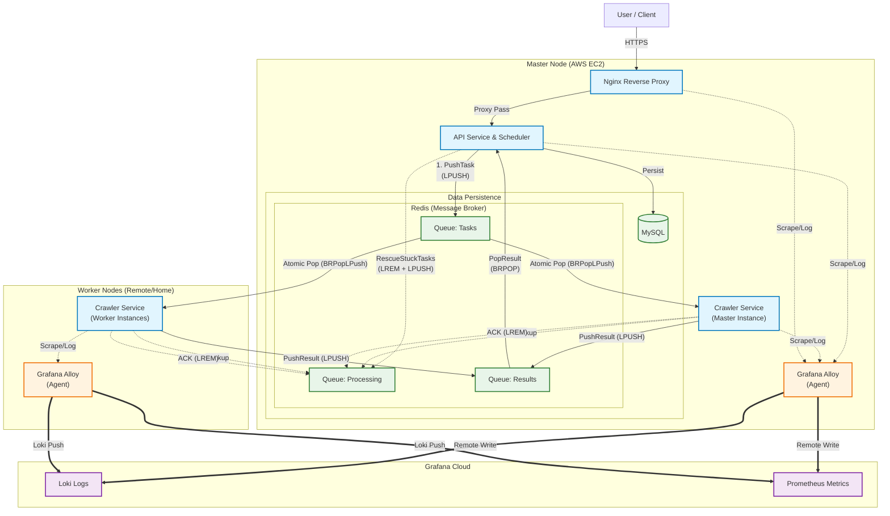

# GoodsHunter V2.0

**Languages / 言語**: [English](README.md) | [日本語](README.ja.md)

> **A High-Performance, Distributed ACGN Merchandise Monitoring & Deal-Hunting System.**

**GoodsHunter** is a specialized system designed for the ACGN second-hand market (e.g., Mercari). In these markets, low-priced items appear sporadically and sell out within minutes. Traditional crawlers struggle with the SPA (Single Page Application) architecture, and manual searching is inefficient.

GoodsHunter addresses these challenges by:
- **Task-Driven Monitoring**: Abstracting user search intent into persistent monitoring tasks.
- **Real-Time & Incremental**: Using periodic fetching with intelligent deduplication to capture new items the moment they appear.
- **Actionable Alerts**: Delivering critical information via a Timeline UI and multi-channel notifications.

V2.0 represents a major paradigm shift from a monolithic application to a fully distributed **Master-Worker** architecture. It is designed to run hybridly: manage your tasks on a cloud server (Master) while leveraging your high-performance machines (Workers) for heavy crawling jobs.


[](https://github.com/KahanaT800/GoodsHunter/actions/workflows/ci.yml)
---
## 🌐 [Click here to visit GoodsHunter](https://goods-hunter.com/)

## Screenshots

### Web Management Interface (Guest View)

*Real-time task management and tracking.*

### Master Node System Monitoring
[](https://lycmuna.grafana.net/goto/afa3n3hqjpu68b?orgId=stacks-1490156)
*[Live Demo: Master Node System Metrics](https://lycmuna.grafana.net/goto/afa3n3hqjpu68b?orgId=stacks-1490156)*

### Crawler Business Metrics
[](https://lycmuna.grafana.net/goto/dfa3n1ojc4p34b?orgId=stacks-1490156)
*[Live Demo: Crawler Business Metrics](https://lycmuna.grafana.net/goto/dfa3n1ojc4p34b?orgId=stacks-1490156)*

---

## Architecture

The system follows a classic Master-Worker topology where the Master node handles state, scheduling, and data persistence, while stateless Worker nodes perform the actual data gathering.



### 🔍 Diagram Explanation (Reliable Queue Model)

This architecture implements a **Reliable Queue** system to ensure zero task loss:

1.  **Decoupling**: The API only communicates with Redis. Workers are autonomous consumers.
2.  **Atomic Transfer**: When a worker picks a task, `BRPopLPush` atomically moves it from the `Pending List` to the `Processing List` (backup).
3.  **Processing State**: The task remains in the `Processing List` while the worker is busy.
4.  **ACK Mechanism**: Upon completion, the worker sends an ACK (executes `LREM`), removing the task from the `Processing List`.
5.  **Janitor Loop**: The Master node runs a "Medical Reaper" background process. If a task remains in the `Processing List` for too long (e.g., Worker power failure), it is reclaimed and pushed back to the `Pending List` for retry.

---

## Key Features

### 1. Distributed Architecture
Scale infinitely by adding more Worker nodes. The system supports **Hybrid Deployment**, allowing you to host the sensitive database and API on a stable low-cost cloud server (e.g., AWS t3.micro) while offloading bandwidth and CPU-intensive browser automation to your powerful local machines.

### 2. High-Reliability Queue
Data safety is paramount. We use a **Redis RPOPLPUSH** (Reliable Queue) pattern with a backup processing queue.
- When a worker picks a task, it moves from `goodshunter:queue:tasks` to `goodshunter:queue:tasks:processing`.
- If a worker crashes or loses power, the task is not lost. It remains in the processing queue and can be recovered by a medical reaper process.

### 3. Distributed Rate Limiting
Prevent your workers from getting blocked. Implemented via **Redis Lua Scripts** using the Token Bucket algorithm, ensuring that global request rates to target sites are strictly controlled across all distributed nodes.

### 4. Full-Stack Observability
Integrated with **Grafana Alloy** (OpenTelemetry Collector compatible).
- **Auto-Injection**: Every metrics push includes the `WORKER_ID`, allowing you to trace performance issues to a specific node.
- **Unified Logging**: Logs from all distributed nodes are shipped to Grafana Loki, searchable in one place.

### 5. Self-Healing Workers
Headless Chrome is notorious for memory leaks over time. We solved this with a **"Suicide on Quota"** strategy. Each worker is configured with a `MAX_TASKS` limit. Once reached, the container gracefully exits, and Docker's `restart: always` policy spins up a fresh, clean instance instantly. This ensures 7x24 stability without manual maintenance.

### 6. Smart Proxy Strategy (Cost Optimization)
Proxies are expensive. GoodsHunter implements an intelligent **Hybrid Network Strategy**. Workers default to direct connections to save costs and reduce latency. Only upon detecting a 403 block do they automatically switch to proxy mode and enter a `PROXY_COOLDOWN`.

### 7. Intelligent Deduplication
Before a task is even scheduled, the `dedup` package calculates a hash of the target parameters. If a similar task is already pending or was recently processed, the duplicate is discarded immediately. This saves CPU cycles and bandwidth, ensuring your workers focus only on fresh data.

---

## Deployment Guide

### Prerequisites
- Docker & Docker Compose
- A Grafana Cloud account (for Alloy metrics/logs)

### Part 1: Master Node Setup
This node hosts the Database and the Redis Scheduler.

1. **Clone the repository**:
   ```bash
   git clone https://github.com/KahanaT800/GoodsHunter.git
   cd GoodsHunter
   ```

2. **Configure Environment**:
   Copy the example config and edit it.
   ```bash
   cp configs/config.yaml.example configs/config.yaml
   # Ensure you set your GRAFANA_CLOUD_* credentials in .env or proper config
   ```

3. **Secure Your Network (Important)**:
   - Ensure TCP port **6379** (Redis) is accessible to your Worker nodes.
   - **SECURITY WARNING**: Use a strong `REDIS_PASSWORD` and restrict access via Security Groups / Firewall (allow only your Home IP).

4. **Start Master Services**:
   ```bash
   docker-compose up -d
   ```

### Part 2: Worker Node Setup
This node only runs the Crawler and Alloy.

1. **Configure Environment**:
   Edit `.env` or set environment variables directly. The most critical one is `REDIS_ADDR` pointing to your Master.

   **Example `.env` for Worker**:
   ```ini
   # Point to your Master Node IP
   REDIS_ADDR=123.45.67.89:6379
   REDIS_PASSWORD=your_strong_password
   
   # Unique Identity for this worker
   WORKER_ID=home-pc-gaming-rig-01
   
   # Grafana Credentials for Observability
   GRAFANA_CLOUD_PROM_REMOTE_WRITE_URL=https://prometheus-blocks-prod-....
   GRAFANA_CLOUD_PROM_USERNAME=123456
   GRAFANA_CLOUD_PROM_API_KEY=glc_....
   ```

2. **Start Worker**:
   We use a specific compose file for workers.
   ```bash
   docker-compose -f docker-compose.worker.yml up -d
   ```

3. **Verify Connection**:
   Check the logs to ensure it connected to the Master Redis.
   ```bash
   docker-compose -f docker-compose.worker.yml logs -f crawler
   ```

---

## Configuration Reference

| Environment Variable | Description | Default |
|----------------------|-------------|---------|
| `REDIS_ADDR` | **Required on Worker**. Address of Master Redis. | `redis:6379` |
| `REDIS_PASSWORD` | Password for Redis authentication. | `goodshunter_redis` |
| `WORKER_ID` | Unique identifier for the node (e.g., `worker-01`). | `worker-01` |
| `APP_RATE_LIMIT` | Requests per second allowed (Token Bucket rate). | `3` |
| `APP_RATE_BURST` | Max burst requests allowed. | `5` |
| `BROWSER_HEADLESS` | Run Chrome in headless mode. Set `false` to watch it work. | `true` |
| `GRAFANA_CLOUD_*` | Credentials for pushing metrics to Grafana Cloud. | (Empty) |

---

## Monitoring Dashboard

We provide ready-to-use Grafana JSON models in `docs/ops/grafana/`. You can also view our live public dashboards:

- **[Cluster Overview (System Resources)](https://lycmuna.grafana.net/goto/bfa3n69fhbv9cb?orgId=stacks-1490156)**
- **[Master Node Monitor](https://lycmuna.grafana.net/goto/afa3n3hqjpu68b?orgId=stacks-1490156)**
- **[Business Metrics](https://lycmuna.grafana.net/goto/dfa3n1ojc4p34b?orgId=stacks-1490156)**

---

## 📄 License

MIT License. See [LICENSE](LICENSE) for details.
