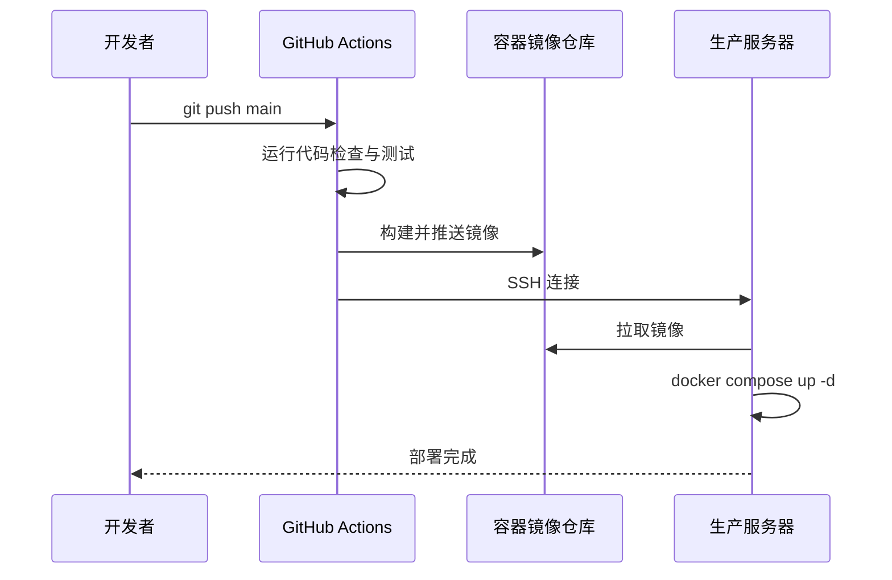

# GoodsHunter

**语言 / Languages / 言語**: [中文](README.md) | [English](README.en.md) | [日本語](README.ja.md)

[](https://go.dev/)
[](https://www.docker.com/)
[](https://github.com/KahanaT800/GoodsHunter/actions/workflows/ci.yml)
[](LICENSE)
[](https://goods-hunter.com)

> **面向生产环境的分布式爬虫系统，聚焦高可靠与可观测**
---

## 项目概述

GoodsHunter 是一个**高性能分布式网络爬虫**系统，专为监控电商平台（如 Mercari）中符合用户搜索条件的新商品而设计。系统采用**纯异步的 Producer-Consumer 架构**，实现了 API 与爬虫节点的完全解耦，支持弹性伸缩与故障自愈。

- **Redis List 队列模型**：基于 `LPUSH`/`BRPOP` 的高效任务分发与结果回传
- **弹性伸缩**：支持一键水平扩展 Worker 节点，线性提升抓取能力
- **故障自愈**：基于任务计数的容器自动重启策略，彻底解决内存泄漏与僵死问题
- **分布式限流**：Redis Lua 原子令牌桶，多实例共享配额
- **可观测性**：Prometheus + Grafana 实时监控队列积压、吞吐量与健康度

## 应用预览

**Web服务**: [https://goods-hunter.com](https://goods-hunter.com)

**访客界面**


**[系统监控仪表盘](https://lycmuna.grafana.net/goto/ff9tttyk3c6psf?orgId=1)**


**[业务监控仪表盘](https://lycmuna.grafana.net/goto/ff9ttron77j7ka?orgId=1)**


---

## 系统架构

GoodsHunter 为基于 **Redis List** 的分布式爬虫系统，采用 **Producer-Consumer** 模型以支持水平扩展与高吞吐量。

```mermaid
graph TB
    User[用户] -->|HTTPS| Nginx[Nginx + SSL]
    Nginx -->|API| API[API 服务]
    
    subgraph Scheduler [调度器 (API)]
        API -->|1. 定期扫描| DB[(MySQL)]
        API -->|2. LPUSH| TaskQueue[(Redis List<br/>goodshunter:queue:tasks)]
    end
    
    subgraph WorkerScale [水平扩展 Worker]
        Crawler1[Crawler 节点 1]
        Crawler2[Crawler 节点 2]
        Crawler3[Crawler 节点 ...]
    end
    
    TaskQueue -->|3. BRPOP (Blocking)| WorkerScale
    WorkerScale -->|4. Execute| Target[目标网站]
    WorkerScale -->|5. LPUSH| ResultQueue[(Redis List<br/>goodshunter:queue:results)]
    
    subgraph Processor [结果处理 (API)]
        ResultQueue -->|6. BRPOP| API
        API -->|7. Update| DB
    end

    WorkerScale -->|Metrics| Prom[Prometheus]
    API -->|Metrics| Prom
    Prom -->|可视化| Grafana[Grafana]
```

### 架构特性
*   **完全解耦 (Decoupling)**:
API 不再感知 Crawler 的存在，仅通过 Redis 交换数据。移除了 gRPC 通信，降低了网络拓扑复杂度与攻击面。
*   **水平扩展 (Horizontal Scaling)**:
Crawler 节点无状态。可以通过 docker-compose scale crawler=N 轻松启动 N 个实例并行抓取，吞吐量线性增长。
*   **自愈能力 (Self-Healing)**:
引入 MAX_TASKS 策略。Crawler 在处理完指定数量的任务后自动优雅退出，依赖 Docker 的 restart: always 机制重启。这彻底解决了 Headless Chrome 长期运行导致的内存泄漏和僵尸进程问题。
*   **双向队列 (Two-Way Queues)**:
    *   **Task Queue**: `goodshunter:queue:tasks`
    *   **Result Queue**: `goodshunter:queue:results`
*   **Producer-Consumer 模型**:
    *   **Producer**: API Server 中的 Scheduler 定期扫描数据库，将待抓取任务推入 Redis。
    *   **Consumer**: 多个 Crawler 实例通过阻塞读取 (`BRPOP`) 抢占任务，实现负载均衡。

### 核心组件

| 服务 | 技术栈 | 职责 | 关键配置 |
|---------|---|---|---|
| **API / Scheduler** | Go + Gin | 生产任务、消费结果、API 网关 | `APP_SCHEDULE_INTERVAL` |
| **Crawler / Worker** | Go + Rod | 消费任务、执行抓取、回传结果 | `MAX_TASKS`, `BROWSER_MAX_CONCURRENCY` |
| **Redis** | Redis | 任务与结果的双向队列 buf | `REDIS_ADDR` |
| **MySQL** | MySQL | 持久化存储 (用户、任务、商品) | `DB_HOST` |
| **Prometheus/Grafana** | Prom/Grafana | 队列深度(积压)、QPS、容器健康度监控 | - |

---

## 核心特性

### 高效任务调度
- 异步优先：所有抓取请求通过 Redis 缓冲，API 响应毫秒级

- 智能重试：支持 ACK 机制（逻辑层），失败任务自动重回队列或进入死信

- 持续监控：任务执行后自动恢复 Active 状态，确保持续周期性监控

### 分布式限流
- 全局限流：Redis Lua 令牌桶，防止触发目标网站反爬
- 前置去重：入队前进行 URL Hash 校验，避免无效任务消耗 Worker 资源

### 稳健的爬虫节点
- 自杀式重启：主动释放资源的生命周期管理，保持环境纯净

- 智能代理切换：优先直连，失败自动熔断切换代理，并具备冷却机制

- 优雅停机：接收信号后停止拉取新任务，但保证在途任务执行完毕

---

## 技术栈

### 后端
- **语言**: Go
- **Web 框架**: Gin
- **序列化**: Protocol Buffers
- **ORM**: GORM
- **浏览器自动化**: Rod

### 基础设施
- **容器化**: Docker + Docker Compose
- **CI/CD**: GitHub Actions
- **云平台**: AWS EC2
- **SSL**: Let's Encrypt + Certbot

### 数据与队列
- **MySQL**: 持久化存储
- **Redis**: 去重、任务队列、限流协作

### 可观测性
- **Prometheus**: 指标采集
- **Grafana**: 仪表盘与告警

---

## 监控与可观测性

### 指标端点
- **API**: `http://<host>:8080/metrics`
- **Crawler**: `http://<host>:2112/metrics`

### 核心关注 (Grafana)
- **Queue Depth (队列积压)**:
    - 关键指标: `crawler_queue_depth{queue_name="tasks"}`
    - 含义: Redis List 中等待被消费的任务数。如果持续升高，说明需要扩容 Crawler。
- **Throughput (吞吐量)**: 
    - 关键指标: `crawler_task_throughput`
    - 含义: 全局每分钟处理的任务数。
- **Crawler Health**:
    - 关键指标: `goodshunter_worker_pool_active`
    - 含义: 当前活跃工作的浏览器实例总数。

### Grafana Cloud（可选）
```bash
docker compose --profile monitoring-cloud up -d alloy
```

---

## 快速开始

### 前置要求
- Docker 20.10+ 与 Docker Compose v2+
- （可选）邮件通知 SMTP 凭据

### 1. 克隆仓库
```bash
git clone https://github.com/KahanaT800/GoodsHunter.git
cd GoodsHunter
```

### 2. 配置环境变量
```bash
cp .env.example .env
# 编辑 .env 文件，设置以下内容：
# - MYSQL_ROOT_PASSWORD  # 数据库密码
# - REDIS_PASSWORD       # Redis 密码
# - JWT_SECRET           # JWT 加密密钥
# - SMTP 凭据（可选）    # 用于邮件通知
```

### 3. 启动服务
```bash
docker compose up -d --build
```

**加速抓取 (水平扩展)**:
启动 3 个爬虫节点以加速任务处理：
```bash
docker compose up -d --scale crawler=3
```

### 4. 访问应用
- **Web 界面**: http://localhost
- **API 健康检查**: http://localhost/healthz
- **API 指标**: http://localhost/metrics
- **Crawler 指标**: http://localhost:2112/metrics

---

## 配置说明（节选）

以下配置直接影响系统吞吐与稳定性（详见 `.env.example`）：

- `APP_SCHEDULE_INTERVAL`：API 扫描数据库生成任务的间隔
- `MAX_TASKS`：**Self-Healing**: 单个 Crawler 实例处理多少任务后重启 (防止内存泄漏)
- `REDIS_ADDR`：Redis 连接地址，用于任务队列与结果回传
- `APP_QUEUE_CAPACITY`：内存队列容量
- `APP_RATE_LIMIT` / `APP_RATE_BURST`：全局限流速率与桶容量
- `BROWSER_MAX_CONCURRENCY`: 单个 Crawler 实例的并发页面数

---

## 质量保证

- `internal/pkg/ratelimit`：并发与超时测试覆盖
- `internal/pkg/dedup`：Redis 去重逻辑测试覆盖
- `internal/api/scheduler`：ACK、重试、DLQ 逻辑测试覆盖

---

## 项目结构

```
GoodsHunter/
├── .github/workflows/       # CI/CD 流水线
├── cmd/
│   ├── api/                 # API 服务入口
│   └── crawler/             # 爬虫服务入口
├── configs/                 # 配置模板与示例
├── deploy/                  # 生产部署配置（Grafana Alloy）
├── docs/                    # 项目文档
│   ├── architecture/        # 架构设计与演进
│   ├── ops/                 # 配置、部署与运维
│   │   └── grafana/          # Grafana 仪表盘 JSON
│   ├── dev/                 # 开发与测试指南
│   ├── archive/             # 归档资料
│   └── README.md            # 文档索引
├── image/                   # README 截图
├── internal/
│   ├── api/                 # HTTP 处理器、中间件、调度器
│   ├── crawler/             # Chromium 自动化、HTML 解析
│   ├── config/              # 配置加载器（环境变量）
│   └── pkg/                 # 共享工具库
│       ├── dedup/           # 全局去重组件
│       ├── ratelimit/       # 分布式限流器
│       ├── metrics/         # Prometheus 指标
│       └── redisqueue/      # Redis List 队列封装
├── build/
│   ├── api/Dockerfile
│   └── crawler/Dockerfile
├── nginx/                   # Nginx 配置
├── proto/
├── scripts/                 # 运维脚本
├── web/
├── docker-compose.yml
└── Makefile
```

---

## API 文档

### 认证相关
```http
POST /api/register
POST /api/login
POST /api/login/guest
POST /api/verify-email?token=xxx
```

### 任务管理
```http
GET    /api/tasks
POST   /api/tasks
PATCH  /api/tasks/:id
DELETE /api/tasks/:id
```

### 时间线
```http
GET /api/timeline?limit=50
```

### 健康检查
```http
GET /healthz
```

---

## 生产环境部署

### 部署流程


---

## 技术决策与权衡

| 决策 | 原因 |
|----------|-----------|
| **Go** | 高性能并发模型，适合 IO 密集型爬虫 |
| **Redis List** | 简单高效的队列原语，支持原子操作 |
| **Redis Lua** | 原子限流，多实例一致 |
| **MySQL** | 事务一致性与成熟生态 |
| **Gin** | 性能好，生态成熟 |

---

## 安全考虑

- **JWT 密钥**：通过环境变量轮换
- **密码哈希**：bcrypt，成本因子 10
- **SQL 注入防护**：GORM 参数化查询
- **HTTPS 强制**：Nginx + Certbot
- **访问控制**：邀请码机制与邮箱验证
- **速率控制**：全局令牌桶限流

---

## 开源协议

本项目采用 **MIT 协议** - 详见 [LICENSE](LICENSE) 文件。

---

## 作者

**KahanaT800**  
联系方式: lyc.muna@gmail.com  
GitHub: [@KahanaT800](https://github.com/KahanaT800)

---

**如果本项目展示了有价值的技能，欢迎 Star 支持！**
