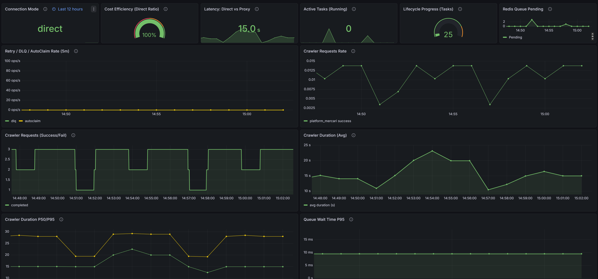
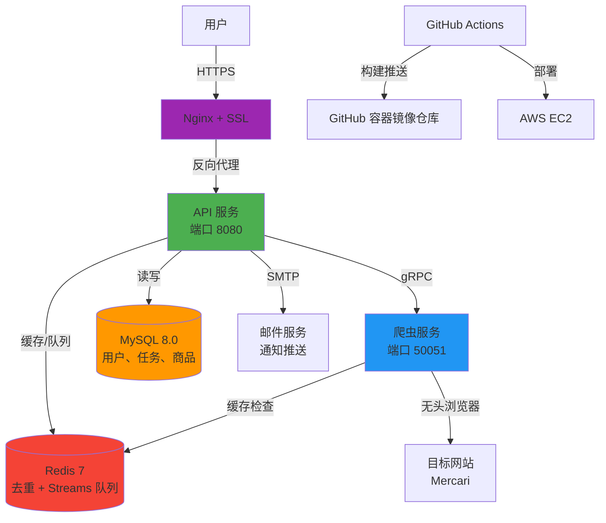
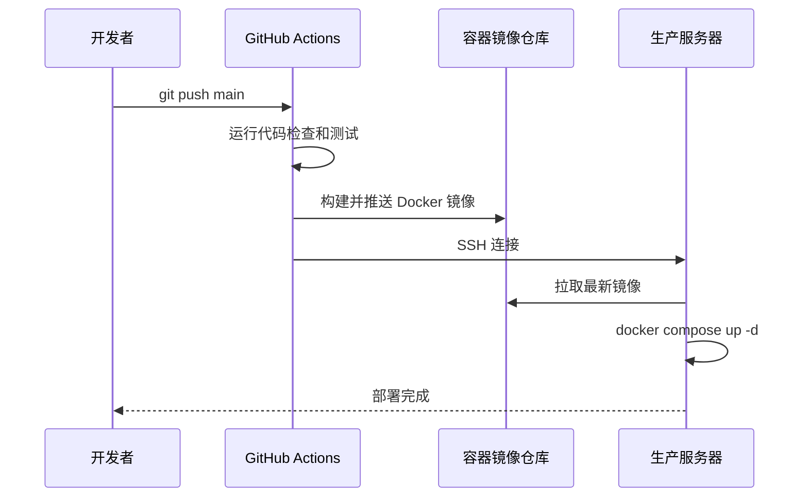

# GoodsHunter

**语言 / Languages / 言語**: [中文](README.md) | [English](README.en.md) | [日本語](README.ja.md)

[](https://go.dev/)
[](https://www.docker.com/)
[](LICENSE)
[](https://goods-hunter.com)

> **可扩展的微服务爬虫系统，支持实时监控电商平台商品**  

**在线演示**: [https://goods-hunter.com](https://goods-hunter.com)

## 应用预览

**访客界面**


**系统监控仪表盘**


**爬虫监控仪表盘**


---

## 项目概述

GoodsHunter 是一个**高性能网络爬虫**系统，专为监控电商平台（如Mercari）中符合用户搜索条件的新商品而设计。本项目通过以下方式展示企业级系统设计能力：

- **微服务架构**: API 和爬虫服务独立部署，通过 gRPC 通信
- **水平可扩展**: 架构设计支持扩展为分布式部署（多实例 + 负载均衡）
- **任务调度系统**: 自动化定时轮询，支持可配置间隔和去重
- **实时通知**: 新商品和价格变动的邮件提醒
- **有状态缓存与分布式队列**: Redis 去重状态 + Redis Streams 任务队列
- **生产环境部署**: 完全自动化的 CI/CD 流程，支持 Docker、HTTPS 和云托管

本项目从零开始构建，旨在展示**适用于生产环境的全栈后端能力**。架构设计为未来的分布式扩展预留了空间。

---

## 系统架构



### **核心组件**

| 服务 | 技术栈 | 职责 |
|---------|-----------|----------------|
| **API 服务器** | Go + Gin 框架 | 用户认证（JWT）、RESTful API、任务调度 |
| **爬虫服务** | Go + Rod | 无头浏览器自动化、HTML 解析、gRPC 服务端 |
| **数据库** | MySQL 8.0 | 用户、任务和爬取商品的持久化存储 |
| **缓存层** | Redis 7 | 去重追踪、价格变动检测、任务队列 |
| **网关** | Nginx + Let's Encrypt | HTTPS 终端、静态文件服务、反向代理 |
| **CI/CD** | GitHub Actions | 自动化测试、Docker 镜像构建、EC2 部署 |

---

## 核心功能

### 智能任务调度
- 用户自定义搜索查询转换为**周期性爬取任务**
- 可配置的执行间隔（5分钟到每天），自动执行
- **工作池（Worker Pool）**模式，精确控制并发数

### 智能去重
- **基于 Redis 的指纹识别**: 追踪已见商品，避免重复通知
- **Redis Streams 队列**: 支持分布式调度与多实例消费（可开关）
- **价格变动检测**: 监控商品降价时自动提醒用户
- **增量爬取**: 仅抓取上次运行后的新增数据

### 生产级认证系统
- **基于 JWT 的会话管理**，安全的令牌存储
- **邮箱验证**流程，用于新用户注册
- **邀请码系统**，控制用户注册权限

### 自动化部署
- **零停机更新**: CI/CD 流水线在 `git push` 后自动部署
- **健康检查**: Docker 原生健康检查确保服务可靠性
- **默认 HTTPS**: 通过 Certbot 自动管理 SSL 证书

---

## 技术栈

### **后端**
- **语言**: Go 1.24（选择原因：强大的并发原语和高性能）
- **Web 框架**: Gin（高性能 HTTP 框架，丰富的中间件生态）
- **RPC**: gRPC + Protocol Buffers（用于服务间通信）
- **ORM**: GORM（数据库抽象层，支持迁移）
- **浏览器自动化**: Rod（快速可靠的 DevTools 协议库）

### **基础设施**
- **容器化**: Docker + Docker Compose
- **编排**: 多阶段构建，优化镜像体积
- **CI/CD**: GitHub Actions（代码检查、构建、自动化部署）
- **云服务商**: AWS EC2（Ubuntu 22.04 LTS）
- **SSL 管理**: Let's Encrypt + Certbot（自动续期）

### **数据层**
- **主数据库**: MySQL 8.0（关系型数据库，提供 ACID 保证）
- **缓存存储**: Redis 7（去重、状态与队列）
- **消息队列**: Redis Streams + 内存队列（可切换）

### **DevOps**
- **版本控制**: Git + GitHub
- **容器镜像仓库**: GitHub Container Registry (GHCR)
- **监控**: Docker 健康检查 + 结构化日志（slog）+ Grafana Cloud（日志与指标）
- **配置管理**: 基于环境变量的配置（12-factor 应用方法论）

---

## 监控与可观测性

### 指标端点
- **API**: `http://<host>:8080/metrics`
- **Crawler**: `http://<host>:2112/metrics`（可通过 `CRAWLER_METRICS_ADDR` 覆盖）

### Grafana Cloud（可选）
```bash
docker compose --profile monitoring-cloud up -d alloy
```

---

## Redis Streams 模式（可选）

默认使用数据库轮询调度任务；启用 Redis Streams 后，任务会通过队列分发，实现更低延迟与多实例水平扩展。

启用方式（`.env`）：
```bash
APP_ENABLE_REDIS_QUEUE=true
APP_TASK_QUEUE_STREAM=goodshunter:task:queue
APP_TASK_QUEUE_GROUP=scheduler_group
```

---

## 快速开始

### **前置要求**
- Docker 20.10+ 和 Docker Compose v2+
- （可选）用于邮件通知的 SMTP 凭据

### **1. 克隆仓库**
```bash
git clone https://github.com/KahanaT800/GoodsHunter.git
cd GoodsHunter
```

### **2. 配置环境变量**
```bash
cp .env.example .env
# 编辑 .env 文件，设置以下内容：
# - MYSQL_ROOT_PASSWORD  # 数据库密码
# - REDIS_PASSWORD       # Redis 密码
# - JWT_SECRET           # JWT 加密密钥
# - SMTP 凭据（可选）    # 用于邮件通知
```

### **3. 启动服务**
```bash
docker compose up -d
```

### **4. 访问应用**
- **Web 界面**: http://localhost
- **API 健康检查**: http://localhost/healthz
- **API 指标**: http://localhost/metrics
- **Crawler 指标**: http://localhost:2112/metrics

### **5. 注册和登录**
```bash
# 游客登录（无需邮箱）
curl -X POST http://localhost/api/login/guest

# 或创建完整账户
curl -X POST http://localhost/api/register \
  -H "Content-Type: application/json" \
  -d '{"email":"user@example.com","password":"secure123","invite_code":"YOUR_CODE"}'
```

---

## 项目结构

```
GoodsHunter/
├── cmd/
│   ├── api/                 # API 服务入口
│   └── crawler/             # 爬虫服务入口
├── configs/                 # 配置模板与示例
├── deploy/                  # 生产部署配置（Grafana Alloy）
├── docs/                    # 项目文档与验收清单
├── internal/
│   ├── api/                 # HTTP 处理器、中间件、认证
│   │   ├── auth/            # JWT 令牌管理
│   │   ├── middleware/      # CORS、日志、认证中间件
│   │   └── scheduler/       # 后台任务调度器
│   ├── crawler/             # Chromium 自动化、HTML 解析
│   ├── config/              # 配置加载器（支持环境变量）
│   ├── model/               # 数据库模型（GORM）
│   └── pkg/                 # 共享工具库
│       ├── logger/          # 结构化日志包装器
│       ├── notify/          # 邮件通知服务
│       └── queue/           # 线程安全任务队列
├── build/
│   ├── api/Dockerfile       # API 多阶段构建文件
│   └── crawler/Dockerfile   # 爬虫多阶段构建文件
├── proto/                   # gRPC 服务定义
├── scripts/                 # 统一脚本入口与运维工具
├── web/                     # 前端静态文件（HTML/CSS/JS）
├── .github/workflows/       # CI/CD 流水线
│   ├── ci.yml              # 代码检查和测试
│   └── deploy.yml          # 自动化部署
├── docker-compose.yml       # 本地开发编排配置
└── scripts/init-letsencrypt.sh     # HTTPS 证书自动化脚本
```

---

## API 文档

### **认证相关**
```http
POST /api/register           # 用户注册
POST /api/login              # 用户登录
POST /api/login/guest        # 游客登录
POST /api/verify-email?token=xxx  # 邮箱验证
```

### **任务管理**
```http
GET    /api/tasks           # 列出用户的监控任务
POST   /api/tasks           # 创建新任务
PATCH  /api/tasks/:id       # 编辑任务条件
DELETE /api/tasks/:id       # 删除任务
```

### **时间线**
```http
GET /api/timeline?limit=50  # 获取最新爬取的商品
```

### **健康检查**
```http
GET /healthz                # 服务状态（Docker 使用）
```

---

## 生产环境部署

### **架构亮点**
- **AWS EC2**: t3.small 实例（2 vCPU，2GB 内存）
- **HTTPS**: Let's Encrypt 通配符证书，自动续期
- **零停机 CI/CD**: GitHub Actions 构建 Docker 镜像 → 推送到 GHCR → SSH 登录 EC2 → 拉取并重启容器
- **安全性**: 非 root 容器，通过环境变量管理密钥

### **部署流程**


### **性能指标**
- **冷启动时间**: ~30 秒（包含 MySQL 初始化）
- **API 响应时间**: <50ms（缓存查询）
- **爬虫吞吐量**: ~100 个商品/分钟（限速以避免被封禁）
- **正常运行时间**: 99.5%+（通过健康检查监控）

---

## 开发指南

### **运行测试**
```bash
go test ./internal/pkg/queue/...
```

### **代码检查**
```bash
golangci-lint run
```

### **查看日志**
```bash
docker logs goodshunter-api-1 -f
docker logs goodshunter-crawler-1 -f
```

### **停止服务**
```bash
docker compose down
```

---

## 技术决策与权衡

| 决策 | 原因 |
|----------|-----------|
| **Go** | 更优秀的并发原语、更低的内存占用、原生 gRPC 支持 |
| **gRPC** | 类型安全的契约、高效的二进制序列化，适合服务间调用 |
| **MySQL** | 熟悉度高、满足当前规模需求、AWS RDS 支持更好 |
| **Redis** | 丰富的数据结构（集合用于去重）、持久化选项 |
| **Gin** | 成熟的生态系统、优秀的性能、丰富的中间件支持 |
| **Rod** | 更简洁的 API、自动等待机制、更好的错误处理 |

---

## 安全考虑

- **JWT 密钥**: 通过环境变量轮换（非硬编码）
- **密码哈希**: bcrypt，成本因子 10
- **SQL 注入防护**: GORM 参数化查询
- **HTTPS 强制**: 所有 HTTP 流量重定向至 HTTPS
- **频率限制**: （计划中）防止爬虫端点滥用

---

## 开源协议

本项目采用 **MIT 协议** - 详见 [LICENSE](LICENSE) 文件。

---

## 作者

**KahanaT800**  
联系方式: lyc.muna@gmail.com  
GitHub: [@KahanaT800](https://github.com/KahanaT800)

---

**如果本项目展示了有价值的技能，欢迎 Star 支持！**
