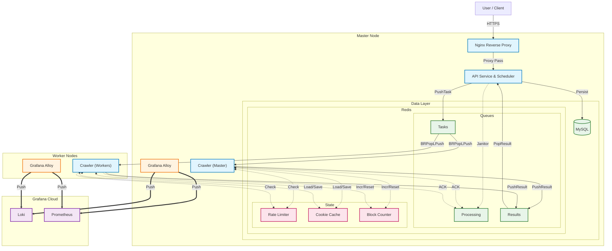

# GoodsHunter V2.1

**Languages / 言語**: [English](README.md) | [日本語](README.ja.md)

> **A High-Performance, Distributed ACGN Merchandise Monitoring & Deal-Hunting System with Advanced Anti-Detection.**

**GoodsHunter** is a specialized system designed for the ACGN second-hand market (e.g., Mercari). In these markets, low-priced items appear sporadically and sell out within minutes. GoodsHunter captures new listings the moment they appear through task-driven monitoring and real-time alerts.


[](https://github.com/KahanaT800/GoodsHunter/actions/workflows/ci.yml)

---

## 🌐 [Click here to visit GoodsHunter](https://goods-hunter.com/)

## Screenshots

### Web Management Interface


### System Monitoring ([Live Demo](https://lycmuna.grafana.net/goto/afa3n3hqjpu68b?orgId=stacks-1490156))
[](https://lycmuna.grafana.net/goto/afa3n3hqjpu68b?orgId=stacks-1490156)

### Business Metrics ([Live Demo](https://lycmuna.grafana.net/goto/dfa3n1ojc4p34b?orgId=stacks-1490156))
[](https://lycmuna.grafana.net/goto/dfa3n1ojc4p34b?orgId=stacks-1490156)

---

## Key Features

| Feature | Description |
|---------|-------------|
| **Distributed Architecture** | Master-Worker topology with hybrid deployment (cloud API + home workers) |
| **Reliable Queue** | Redis RPOPLPUSH pattern with Janitor recovery for zero task loss |
| **Distributed Rate Limiting** | Token Bucket via Redis Lua scripts, coordinated across all nodes |
| **Anti-Detection (V2.1)** | Stealth scripts, human behavior simulation, cookie persistence |
| **Adaptive Throttling** | Auto-cooldown on consecutive blocks with Redis-synchronized counters |
| **Self-Healing Workers** | "Suicide on Quota" strategy with Docker auto-restart |
| **Full Observability** | Grafana Alloy integration for metrics and logs |

📖 **[Full Feature Details →](docs/architecture/design.md)**

---

## Quick Start

### Prerequisites
- Docker & Docker Compose
- (Optional) Grafana Cloud account for observability

### Master Node
```bash
git clone https://github.com/KahanaT800/GoodsHunter.git
cd GoodsHunter
cp configs/config.yaml.example configs/config.yaml
docker-compose up -d
```

### Worker Node
```bash
# Set environment variables
export REDIS_ADDR=<master-ip>:6379
export REDIS_PASSWORD=<your-password>
export WORKER_ID=worker-01

docker-compose -f docker-compose.worker.yml up -d
```

📖 **[Full Deployment Guide →](docs/ops/deployment_modes.md)**

---

## Configuration

### Essential Environment Variables

| Variable | Description | Default |
|----------|-------------|---------|
| `REDIS_ADDR` | Master Redis address | `redis:6379` |
| `REDIS_PASSWORD` | Redis password | (Empty) |
| `WORKER_ID` | Unique worker identifier | `worker-01` |
| `APP_RATE_LIMIT` | Requests per second | `3` |
| `BROWSER_MAX_CONCURRENCY` | Concurrent browser pages | `3` |
| `MAX_TASKS` | Tasks before auto-restart | `500` |

📖 **[Full Configuration Reference →](docs/ops/configuration.md)**

---

## Architecture

Master-Worker topology with Redis as message broker and distributed state store.



**Key Points:**
- **Reliable Queue**: `BRPopLPush` ensures zero task loss with Janitor recovery
- **Distributed State**: Rate limiter, cookie cache, and block counters are shared across all nodes via Redis

📖 **[Full Architecture Details →](docs/architecture/design.md)**

---

## Monitoring

Live dashboards available:
- **[Cluster Overview](https://lycmuna.grafana.net/goto/bfa3n69fhbv9cb?orgId=stacks-1490156)**
- **[Master Node](https://lycmuna.grafana.net/goto/afa3n3hqjpu68b?orgId=stacks-1490156)**
- **[Business Metrics](https://lycmuna.grafana.net/goto/dfa3n1ojc4p34b?orgId=stacks-1490156)**

Grafana JSON templates: `docs/ops/grafana/`

---

## Documentation

| Topic | Link |
|-------|------|
| Architecture Design | [docs/architecture/design.md](docs/architecture/design.md) |
| Configuration Guide | [docs/ops/configuration.md](docs/ops/configuration.md) |
| Deployment Modes | [docs/ops/deployment_modes.md](docs/ops/deployment_modes.md) |
| Local Testing | [docs/dev/local_test_checklist.md](docs/dev/local_test_checklist.md) |

---

## 📄 License

MIT License. See [LICENSE](LICENSE) for details.
